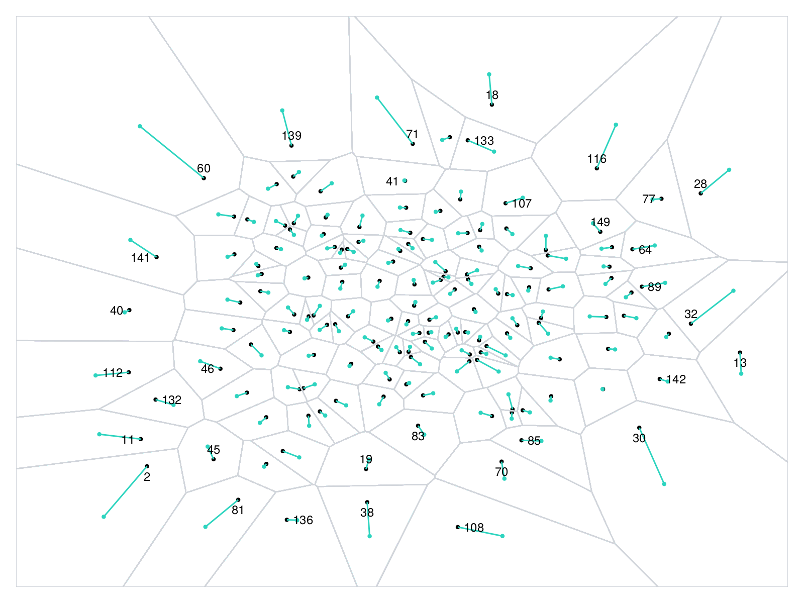

# MakieAnnotation

MakieAnnotations is a julia package that provides extended support for plot annotations in [Makie.jl](https://github.com/MakieOrg/Makie.jl/). It is inspired by the great [d3-annotation](https://github.com/susielu/d3-annotation) library for D3.

## Features
- Automatic labelling for scatter plots using voronoi diagrams

## API
### Voronoi labels
MakieAnnotation provides automatic labelling of scatter plots using [Voronoi diagrams](https://en.wikipedia.org/wiki/Voronoi_diagram). If the number of data points in a scatter plot is large, then not all points can accomodate labels. By using Voronoi labels the visibility of a label is determined by the area of the associated voronoi cell. If the cell area is large, then the label is displayed. Otherwise the label is not visible. The positioning of the label is determined by the vector between the data point and the cell centroid. Depending on the direction of the vector, the label displayed on top, bottom, left, or right of the data point.

The final result excluding the Voronoi diagram will look like this:

To create labels using `voronoilabels` or `voronoilabels!` you are required to specify

- `boundingbox::Rectangle`: The outer boundary of the Voronoi diagram
- `cutoff`: A numeric value specifying the cutoff value for label display. If `area(cell) >= cutoff` then the label will be displayed in the plot.

